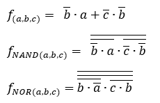
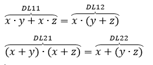
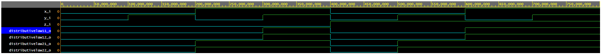

# Laboratórna úloha číslo 1

## 1. GitHub:

Link repozitára: https://github.com/DaNNym99/Digital-electronics-1

## 2. De Morgánove zákony:

Rovnice:


Program vhdl :

```vhdl
architecture dataflow of gates is
begin
    f_o  <= ((not b_i)and a_i) or ((not c_i) and (not b_i));
    fnand_o <= (('1' nand b_i) nand a_i) nand (('1' nand c_i) nand ('1' nand b_i));
    fnor_o <= '0' nor ((b_i nor ('0' nor a_i)) nor (c_i nor b_i));

end architecture dataflow;
```

Link pre edaplayground (De Morgánove zákony): https://www.edaplayground.com/x/aXrz

Výstup z programu edaplayground:
| **c** | **b** |**a** | **f(c,b,a)** | **fNAND(c,b,a)** | **fNOR(c,b,a)** |
| :-: | :-: | :-: | :-: | :-: | :-: |
| 0 | 0 | 0 | 1 | 1 | 1 |
| 0 | 0 | 1 | 1 | 1 | 1 |
| 0 | 1 | 0 | 0 | 0 | 0 |
| 0 | 1 | 1 | 0 | 0 | 0 |
| 1 | 0 | 0 | 0 | 0 | 0 |
| 1 | 0 | 1 | 1 | 1 | 1 |
| 1 | 1 | 0 | 0 | 0 | 0 |
| 1 | 1 | 1 | 0 | 0 | 0 |

Obrázok výstupu:


## 3. Distributívne zákony:

Rovnice:


Program vhdl :

```vhdl
architecture dataflow of gates is
begin
    Distributivelaw11_o <= (x_i and y_i) or (x_i and z_i);
    Distributivelaw12_o <= x_i and (y_i or z_i);
    Distributivelaw21_o <= (x_i or y_i) and (x_i or z_i);
    Distributivelaw22_o <= x_i or (y_i and z_i);

end architecture dataflow;
```

Link pre edaplayground (Distributívne zákony): https://www.edaplayground.com/x/8MeM

Výstup z programu edaplayground:
| **z** | **y** |**x** | **DL11(x,y,z)** | **DL12(x,y,z)** | **DL21(x,y,z)** | **DL22(x,y,z)** |
| :-: | :-: | :-: | :-: | :-: | :-: | :-: |
| 0 | 0 | 0 | 0 | 0 | 0 | 0 |
| 0 | 0 | 1 | 0 | 0 | 0 | 0 |
| 0 | 1 | 0 | 0 | 0 | 1 | 1 |
| 0 | 1 | 1 | 1 | 1 | 1 | 1 |
| 1 | 0 | 0 | 0 | 0 | 0 | 0 |
| 1 | 0 | 1 | 0 | 0 | 1 | 1 |
| 1 | 1 | 0 | 1 | 1 | 1 | 1 |
| 1 | 1 | 1 | 1 | 1 | 1 | 1 |

Obrázok výstupu:


