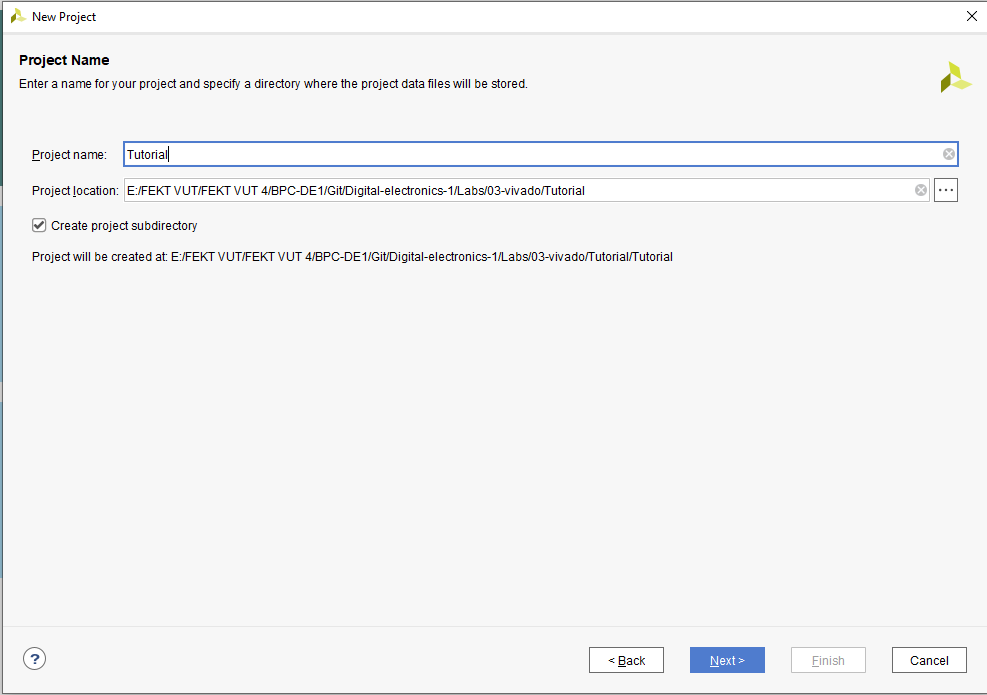
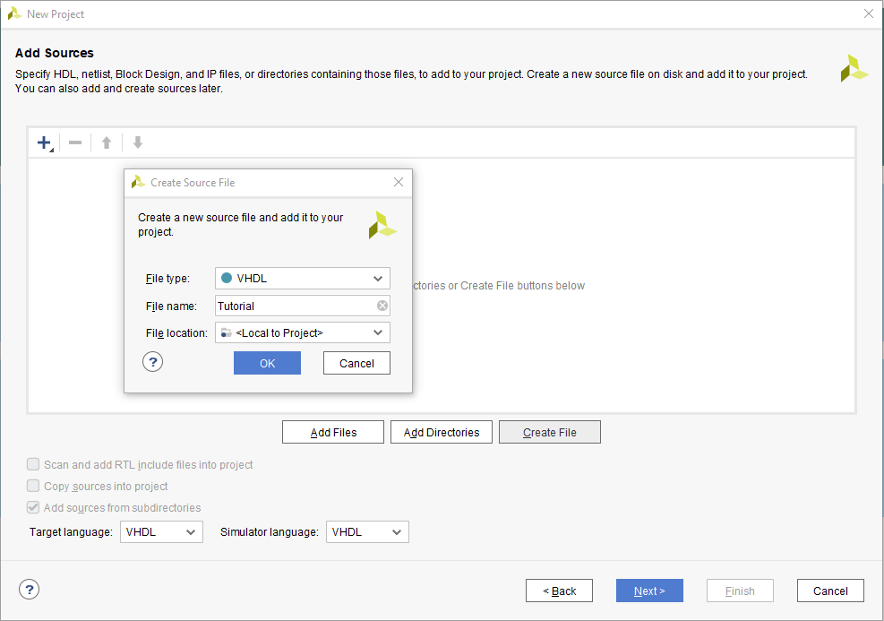
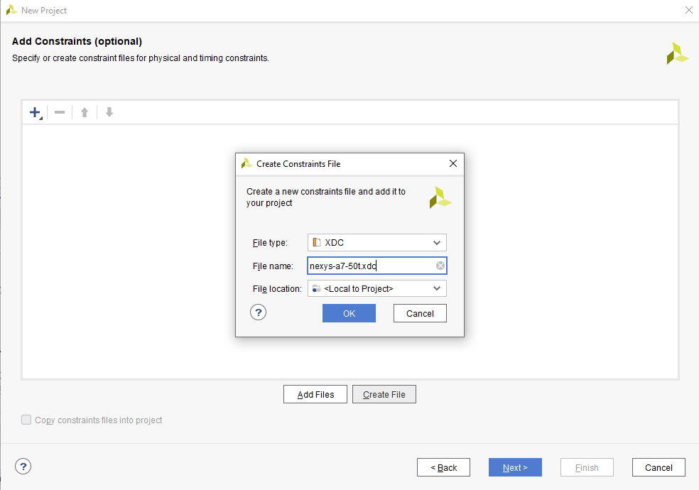
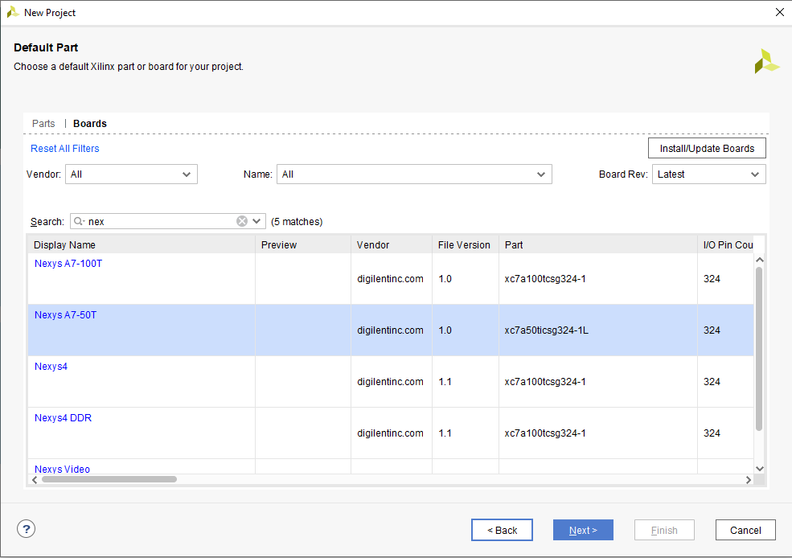

# Laboratórna úloha číslo 1
### *Daniel Haluška*

## GitHub:

Link repozitára: https://github.com/DaNNym99/Digital-electronics-1

## 1. Zapojenie Nexys A7 board:

### 1.1. Board


### 1.2. Mapovanie vstupov/vystupov
| **Ozacenie** | **Port (Entity)** |**Funkcia** |
| :-: | :-: | :-: | 
| J15 | a_i[0] | SW0 | 
| L16 | a_i[1] | SW1 |
| M13 | b_i[0] | SW2 |
| R15 | b_i[1] | SW3 |
| R17 | c_i[0] | SW4 |
| T18 | c_i[1] | SW5 |
| U18 | d_i[0] | SW6 |
| R13 | d_i[1] | SW7 |
| U11 | sel_i[0] | SW7 |
| V10 | sel_i[1] | SW7 |
| H17 | f_o[0] | LD0 |
| K15 | f_o[1] | LD1 |

## 2. 4-to-1 Multiplexor

### 2.1. Súbor mux_2bit_4to1.vhd

```vhdl
library ieee;
use ieee.std_logic_1164.all;

------------------------------------------------------------------------
-- Entity declaration for 2-bit binary comparator
------------------------------------------------------------------------
entity mux_2bit_4to1 is
    port
    (

        a_i           : in  std_logic_vector(2 - 1 downto 0);
        b_i           : in  std_logic_vector(2 - 1 downto 0);
        c_i           : in  std_logic_vector(2 - 1 downto 0);
        d_i           : in  std_logic_vector(2 - 1 downto 0);
        sel_i         : in  std_logic_vector(2 - 1 downto 0);

        f_o           : out std_logic_vector(2 - 1 downto 0)

    );
end entity mux_2bit_4to1;

------------------------------------------------------------------------
-- Architecture body for 2-bit binary comparator
------------------------------------------------------------------------
architecture Behavioral of mux_2bit_4to1 is
begin

    f_o <= a_i when (sel_i = "00") else 
           b_i when (sel_i = "01") else 
           c_i when (sel_i = "10") else 
           d_i when (sel_i = "11");

end architecture Behavioral;
```

### 2.2. Súbor tb_mux_2bit_4to1.vhd

```vhdl
library ieee;
use ieee.std_logic_1164.all;

------------------------------------------------------------------------
-- Entity declaration for testbench
------------------------------------------------------------------------
entity tb_mux_2bit_4to1 is
    -- Entity of testbench is always empty
end entity tb_mux_2bit_4to1;

------------------------------------------------------------------------
-- Architecture body for testbench
------------------------------------------------------------------------
architecture testbench of tb_mux_2bit_4to1 is

    -- Local signals
    signal s_a       : std_logic_vector(2 - 1 downto 0);
    signal s_b       : std_logic_vector(2 - 1 downto 0);
    signal s_c       : std_logic_vector(2 - 1 downto 0);
    signal s_d       : std_logic_vector(2 - 1 downto 0);
    signal s_sel     : std_logic_vector(2 - 1 downto 0);

    signal s_f         : std_logic_vector(2 - 1 downto 0);

begin
    -- Connecting testbench signals with comparator_2bit entity (Unit Under Test)
    uut_mux_2bit_4to1 : entity work.mux_2bit_4to1
        port map
        (

            a_i           => s_a,
            b_i           => s_b,
            c_i           => s_c,
            d_i           => s_d,
            sel_i         => s_sel,

            f_o => s_f

        );

--------------------------------------------------------------------
    -- Data generation process
    --------------------------------------------------------------------
    p_stimulus : process
    begin
        -- Report a note at the begining of stimulus process
        report "Stimulus process started" severity note;


        s_d <= "00"; s_c <= "00"; s_b <= "00"; s_a <= "00"; wait for 100 ns;
        s_sel <= "00"; wait for 100 ns;

        s_a <= "01"; wait for 100 ns;
        s_b <= "01"; wait for 100 ns;

        s_sel <= "01"; wait for 100 ns;
        s_c <= "00"; wait for 100 ns;
        s_b <= "11"; wait for 100 ns;

        s_d <= "10";
        s_c <= "11";
        s_b <= "01";
        s_a <= "00"; 
        s_sel <= "10";
        wait for 100 ns;
        
        s_d <= "00";
        s_c <= "00";
        s_b <= "00";
        s_a <= "01"; 
        s_sel <= "10";
        wait for 100 ns;
        
        s_d <= "10";
        s_c <= "11";
        s_b <= "01";
        s_a <= "00"; 
        s_sel <= "11";
        wait for 100 ns;
        
        -- Report a note at the end of stimulus process
        report "Stimulus process finished" severity note;
        wait;
    end process p_stimulus;

end architecture testbench;
```

### 2.3. Symulovaný výstup
 


## 3. Tutorial:

### 3.1. Stav po zapnutí

- pre vytvorenie projektu klikneme na create project a zvolíme next
### 3.2. Pomenovanie projektu

- zvolíme meno projektu a zložku kde má byť projek uložený
- na nasledujúcej karte zvolíme RTL project
### 3.3. Pridanie source file

- pre programovanie vo VHDL zmeníme cilový jazyk a jazyk simulátoru na VHDL a pridáme pomocou create file zdrojový súbor
### 3.4. Vytvorenie súboru spolupracujuceho s doskou

- pomocou create file vytvoríme subor do ktorého nasledne nakopírujeme Nexis A7 z githubu
### 3.6. Pridanie vyvojovej dosky

- na vrchnej ponuke sa preklikneme na boards a vyhladáme nami používanú dosku (Nexis A7-50T)
### 3.7. Vytvorenie testovacieho súboru

- po vytvorení projektu klikneme pravím na Simulation Sources > Add sources > Add or create simulation sources > Create file zvolíme názov súboru a necháme vytvoriť