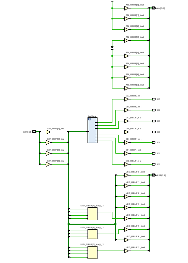
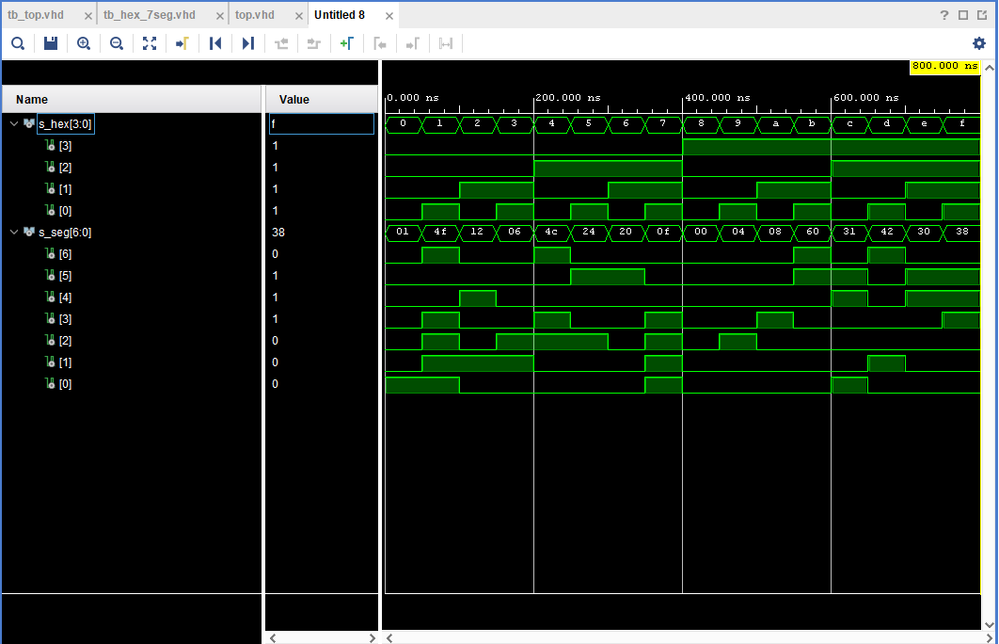
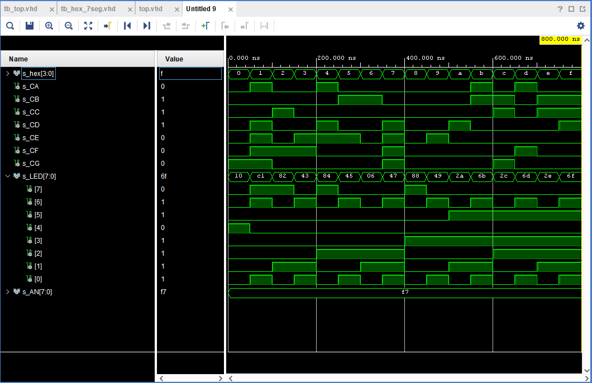

# Laboratórna úloha číslo 4
### *Daniel Haluška*

## GitHub:

Link repozitára: https://github.com/DaNNym99/Digital-electronics-1

## 1. Zapojenie Nexis 7 a Pravdivostná tabuľka:

### 1.1. Board

### 1.2. Mapovanie 7-segment
| **Ozacenie** | **Port (Entity)** |**Funkcia** |
| :-: | :-: | :-: | 
| T10 | CA | A | 
| R10 | CB | B |
| K16 | CC | C |
| K13 | CD | D |
| P15 | CE | E |
| T11 | CF | F |
| L18 | CG | G |
| J17 | AN[0] | KAT 1 |
| J18 | AN[1] | KAT 2 |
| T9 | AN[2] | KAT 3 |
| J14 | AN[3] | KAT 4 |
| P14 | AN[4] | KAT 5 |
| T14 | AN[5] | KAT 6 |
| K2 | AN[6] | KAT 7 |
| U13 | AN[7] | KAT 8 |

### 1.3. Pravdivosná tabuľka pre 7-segment spoločná anóda

| **Hex** | **Inputs** | **A** | **B** | **C** | **D** | **E** | **F** | **G** |
| :-: | :-: | :-: | :-: | :-: | :-: | :-: | :-: | :-: |
| 0 | 0000 | 0 | 0 | 0 | 0 | 0 | 0 | 1 |
| 1 | 0001 | 1 | 0 | 0 | 1 | 1 | 1 | 1 |
| 2 | 0010 | 0 | 0 | 1 | 0 | 0 | 1 | 0 |
| 3 | 0011 | 0 | 0 | 0 | 0 | 1 | 1 | 0 |
| 4 | 0100 | 1 | 0 | 0 | 1 | 1 | 0 | 0 |
| 5 | 0101 | 0 | 1 | 0 | 0 | 1 | 0 | 0 |
| 6 | 0110 | 0 | 1 | 0 | 0 | 0 | 0 | 0 |
| 7 | 0111 | 0 | 0 | 0 | 1 | 1 | 1 | 1 |
| 8 | 1000 | 0 | 0 | 0 | 0 | 0 | 0 | 0 |
| 9 | 1001 | 0 | 0 | 0 | 0 | 1 | 0 | 0 |
| A | 1010 | 0 | 0 | 0 | 1 | 0 | 0 | 0 |
| b | 1011 | 1 | 1 | 0 | 0 | 0 | 0 | 0 |
| C | 1100 | 0 | 1 | 1 | 0 | 0 | 0 | 1 |
| d | 1101 | 1 | 0 | 0 | 0 | 0 | 1 | 0 |
| E | 1110 | 0 | 1 | 1 | 0 | 0 | 0 | 0 |
| F | 1111 | 0 | 1 | 1 | 1 | 0 | 0 | 0 |

## 2. 7-Segmentovy display

### 2.1. Súbor source hex_7seg.vhd
```vhdl
entity hex_7seg is
    port
    (
        hex_i           : in  std_logic_vector(4 - 1 downto 0);
        seg_o           : out std_logic_vector(7 - 1 downto 0) 
    );
end entity hex_7seg;

------------------------------------------------------------------------
-- Architecture body for 2-bit binary comparator
------------------------------------------------------------------------
architecture Behavioral of hex_7seg is
begin

p_7seg_decoder : process(hex_i)
    begin
        case hex_i is
            when "0000" =>
                seg_o <= "0000001";     -- 0
            when "0001" =>
                seg_o <= "1001111";     -- 1
            when "0010" =>
                seg_o <= "0010010";     -- 2
            when "0011" =>
                seg_o <= "0000110";     -- 3
            when "0100" =>
                seg_o <= "1001100";     -- 4
            when "0101" =>
                seg_o <= "0100100";     -- 5    
            when "0110" =>
                seg_o <= "0100000";     -- 6
            when "0111" =>
                seg_o <= "0001111";     -- 7
            when "1000" =>
                seg_o <= "0000000";     -- 8
            when "1001" =>
                seg_o <= "0000100";     -- 9
            when "1010" =>
                seg_o <= "0001000";     -- A 
            when "1011" =>
                seg_o <= "1100000";     -- B
            when "1100" =>
                seg_o <= "0110001";     -- C
            when "1101" =>
                seg_o <= "1000010";     -- D 
            when "1110" =>
                seg_o <= "0110000";     -- E
            when others =>
                seg_o <= "0111000";     -- F
        end case;
    end process p_7seg_decoder;
  
end architecture Behavioral;
```
### 2.2. Súbor tb_hex_7seg.vhl
```vhdl
architecture Behavoral of tb_hex_7seg is

    -- Local signals
    signal s_hex       : std_logic_vector(4 - 1 downto 0);
    signal s_seg       : std_logic_vector(7 - 1 downto 0);
    
begin
    -- Connecting testbench signals with comparator_2bit entity (Unit Under Test)
    uut_hex_7seg : entity work.hex_7seg
        port map
        (

            hex_i         => s_hex,
            seg_o         => s_seg
 
        );

--------------------------------------------------------------------
    -- Data generation process
    --------------------------------------------------------------------
    p_stimulus : process
    begin
        -- Report a note at the begining of stimulus process
        report "Stimulus process started" severity note;


        s_hex <= "0000";
        wait for 50 ns;
        s_hex <= "0001";
        wait for 50 ns;
        s_hex <= "0010";
        wait for 50 ns;
        s_hex <= "0011";
        wait for 50 ns;
        s_hex <= "0100";
        wait for 50 ns;
        s_hex <= "0101";
        wait for 50 ns;
        s_hex <= "0110";
        wait for 50 ns;
        s_hex <= "0111";
        wait for 50 ns;
        s_hex <= "1000";
        wait for 50 ns;
        s_hex <= "1001";
        wait for 50 ns;
        s_hex <= "1010";
        wait for 50 ns;
        s_hex <= "1011";
        wait for 50 ns;
        s_hex <= "1100";
        wait for 50 ns;
        s_hex <= "1101";
        wait for 50 ns;
        s_hex <= "1110";
        wait for 50 ns;
        s_hex <= "1111";
        wait for 50 ns;
         
        -- Report a note at the end of stimulus process
        report "Stimulus process finished" severity note;
        wait;
    end process p_stimulus;

end architecture Behavoral;
```
### 2.3. Schema


### 2.4. Symulovaný výstup


### 2.4. Súbor top.vhl
```vhdl
library IEEE;
use IEEE.STD_LOGIC_1164.ALL;

entity top is
    Port ( 
           SW : in STD_LOGIC_VECTOR (4 - 1 downto 0);
           CA : out STD_LOGIC;
           CB : out STD_LOGIC;
           CC : out STD_LOGIC;
           CD : out STD_LOGIC;
           CE : out STD_LOGIC;
           CF : out STD_LOGIC;
           CG : out STD_LOGIC;

           LED : out std_logic_vector (8 - 1 downto 0);
           AN : out std_logic_vector (8 - 1 downto 0)    
           );    
end top;

architecture Behavioral of top is
begin

    --------------------------------------------------------------------
    -- Instance (copy) of hex_7seg entity
    hex2seg : entity work.hex_7seg
        port map(
            hex_i    => SW,
            seg_o(6) => CA,
            seg_o(5) => CB,
            seg_o(4) => CC,
            seg_o(3) => CD,
            seg_o(2) => CE,
            seg_o(1) => CF,
            seg_o(0) => CG
        );

    -- Connect one common anode to 3.3V
    AN <= b"1111_0111";

    -- Display input value
    LED(3 downto 0) <= SW;
    LED(4)  <= '1' when (SW = "0000") else '0';
    LED(5)  <= '1' when (SW > "1001") else '0';
    LED(6)  <= '1' when (SW = "0001" or SW = "0011" or SW = "0101" or SW = "0111" or SW = "1001" or SW = "1011" or SW = "1101" or SW = "1111") else '0';
    LED(7)  <= '1' when (SW = "0001" or SW = "0010" or SW = "0100" or SW = "1000") else '0';
    
end architecture Behavioral;
```

## 3. LED indikátory

### 3.1. Pravdivosná tabuľka pre LED 4 - 7
| **Hex** | **Inputs** | **LED4** | **LED5** | **LED6** | **LED7** |
| :-: | :-: | :-: | :-: | :-: | :-: |
| 0 | 0000 | 1 | 0 | 0 | 0 |
| 1 | 0001 | 0 | 0 | 1 | 0 |
| 2 | 0010 | 0 | 0 | 0 | 1 |
| 3 | 0011 | 0 | 0 | 1 | 0 |
| 4 | 0100 | 0 | 0 | 0 | 1 |
| 5 | 0101 | 0 | 0 | 1 | 0 |
| 6 | 0110 | 0 | 0 | 0 | 1 |
| 7 | 0111 | 0 | 0 | 1 | 0 |
| 8 | 1000 | 0 | 0 | 0 | 1 |
| 9 | 1001 | 0 | 0 | 1 | 0 |
| A | 1010 | 0 | 1 | 0 | 0 |
| b | 1011 | 0 | 1 | 0 | 0 |
| C | 1100 | 0 | 1 | 0 | 0 |
| d | 1101 | 0 | 1 | 0 | 0 |
| E | 1110 | 0 | 1 | 0 | 0 |
| F | 1111 | 0 | 1 | 0 | 0 |

### 3.2. Syntax pre LED 4 - 7

```vhdl
    LED(3 downto 0) <= SW;
    LED(4)  <= '1' when (SW = "0000") else '0';
    LED(5)  <= '1' when (SW > "1001") else '0';
    LED(6)  <= '1' when (SW = "0001" or SW = "0011" or SW = "0101" or SW = "0111" or SW = "1001" or SW = "1011" or SW = "1101" or SW = "1111") else '0';
    LED(7)  <= '1' when (SW = "0001" or SW = "0010" or SW = "0100" or SW = "1000") else '0';
```

### 3.3. Súbor top.vhl
```vhdl
library IEEE;
use IEEE.STD_LOGIC_1164.ALL;

entity tb_top is

end tb_top;

architecture Behavoral of tb_top is

    signal s_hex : std_logic_vector(4 - 1 downto 0);
    signal s_CA : STD_LOGIC;
    signal s_CB : STD_LOGIC;
    signal s_CC : STD_LOGIC;
    signal s_CD : STD_LOGIC;
    signal s_CE : STD_LOGIC;
    signal s_CF : STD_LOGIC;
    signal s_CG : STD_LOGIC;
    signal s_LED : std_logic_vector (8 - 1 downto 0);
    signal s_AN : std_logic_vector (8 - 1 downto 0);
   
begin
  
    uut_top : entity work.top
        port map
        (

            SW      => s_hex,
            CA      => s_CA,
            CB      => s_CB,
            CC      => s_CC,
            CD      => s_CD,
            CE      => s_CE,
            CF      => s_CF,
            CG      => s_CG,
            LED     => s_LED,
            AN      => s_AN
        );

    p_stimulus : process
    begin
        -- Report a note at the begining of stimulus process
        report "Stimulus process started" severity note;


        s_hex <= "0000";
        wait for 50 ns;
        s_hex <= "0001";
        wait for 50 ns;
        s_hex <= "0010";
        wait for 50 ns;
        s_hex <= "0011";
        wait for 50 ns;
        s_hex <= "0100";
        wait for 50 ns;
        s_hex <= "0101";
        wait for 50 ns;
        s_hex <= "0110";
        wait for 50 ns;
        s_hex <= "0111";
        wait for 50 ns;
        s_hex <= "1000";
        wait for 50 ns;
        s_hex <= "1001";
        wait for 50 ns;
        s_hex <= "1010";
        wait for 50 ns;
        s_hex <= "1011";
        wait for 50 ns;
        s_hex <= "1100";
        wait for 50 ns;
        s_hex <= "1101";
        wait for 50 ns;
        s_hex <= "1110";
        wait for 50 ns;
        s_hex <= "1111";
        wait for 50 ns;
         
        -- Report a note at the end of stimulus process
        report "Stimulus process finished" severity note;
        wait;
    end process p_stimulus;

end architecture Behavoral;
```

### 3.3. Symulovaný výstup
