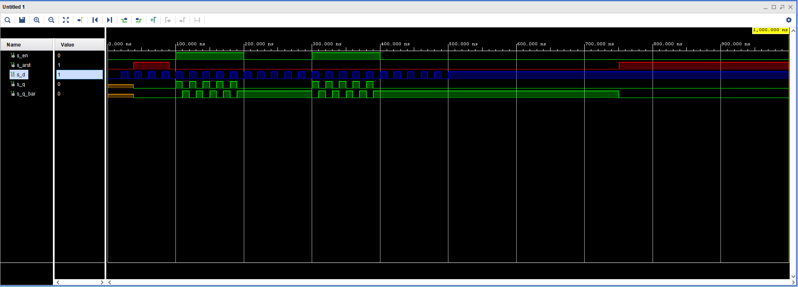

# Laboratórna úloha číslo 7
### *Daniel Haluška*

## GitHub:

Link repozitára: https://github.com/DaNNym99/Digital-electronics-1

## 1. Pravdivostne tabulky

### 1.1. D-ff

   | **D** | **Qn** | **Q(n+1)** | **Comments** |
   | :-: | :-: | :-: | :-- |
   | 0 | 0 | 0 | Zapis pri nabeznej hrane |
   | 0 | 1 | 0 | Zapis pri nabeznej hrane |
   | 1 | 0 | 1 | Zapis pri nabeznej hrane |
   | 1 | 1 | 1 | Zapis pri nabeznej hrane |

### 1.2. JK-ff

   | **J** | **K** | **Qn** | **Q(n+1)** | **Comments** |
   | :-: | :-: | :-: | :-: | :-- |
   | 0 | 0 | 0 | 0 | No change |
   | 0 | 0 | 1 | 1 | No change |
   | 0 | 1 | 0 | 0 | Reset |
   | 0 | 1 | 1 | 0 | Reset |
   | 1 | 0 | 0 | 1 | Set |
   | 1 | 0 | 1 | 1 | Set |
   | 1 | 1 | 0 | 1 | Invertor |
   | 1 | 1 | 1 | 0 | Invertor |

### 1.2. T-ff

   | **T** | **Qn** | **Q(n+1)** | **Comments** |
   | :-: | :-: | :-: | :-- |
   | 0 | 0 | 0 | Pamatanie |
   | 0 | 1 | 1 | Pamatanie |
   | 1 | 0 | 1 | Invertor |
   | 1 | 1 | 0 | Invertor |

## 2. D-latch

### 2.1. Proces p_d_latch
```vhdl
p_d_latch : process (d, arst, en)
    begin
        if (arst = '1') then
            q <= '0';
            q_bar <= '0';
        elsif (en ='1')then
            q <= d;
            q_bar <= not d;
                    
        end if;
    end process p_d_latch;
```
### 2.2. Súbor tb_d_latch.vhdl
```vhdl
 p_reset : process
    begin
        s_arst <= '0';
        wait for 38 ns;
        s_arst <= '1';
        wait for 53 ns;  
        -- Reset activated
        s_arst <= '0';
        wait for 660 ns;
        s_arst <= '1';
        wait;

 p_stimulus : process
    begin
        report "Stimulus process started" severity note;
            s_d <= '0';
            s_en <= '0';
            
            assert(s_q ='0')
            report "" severity error;
            
            
            wait for 10ns;
            s_d <= '0';
            wait for 10ns;
            s_d <= '1';
            wait for 10ns;
            s_d <= '0';
            wait for 10ns;
            s_d <= '1';
            wait for 10ns;
            s_d <= '0';
            wait for 10ns;
            s_d <= '1';
            wait for 10ns;
            s_d <= '0';
            wait for 10ns;
            s_d <= '1';
            wait for 10ns;
            s_d <= '0';
            wait for 10ns;
            s_d <= '1';
            
            s_en <= '1';
            wait for 10ns;
            s_d <= '0';
            wait for 10ns;
            s_d <= '1';
            wait for 10ns;
            s_d <= '0';
            wait for 10ns;
            s_d <= '1';
            wait for 10ns;
            s_d <= '0';
            wait for 10ns;
            s_d <= '1';
            wait for 10ns;
            s_d <= '0';
            wait for 10ns;
            s_d <= '1';
            wait for 10ns;
            s_d <= '0';
            wait for 10ns;
            s_d <= '1';
            
            s_en <= '0';
            wait for 10ns;
            s_d <= '0';
            wait for 10ns;
            s_d <= '1';
            wait for 10ns;
            s_d <= '0';
            wait for 10ns;
            s_d <= '1';
            wait for 10ns;
            s_d <= '0';
            wait for 10ns;
            s_d <= '1';
            wait for 10ns;
            s_d <= '0';
            wait for 10ns;
            s_d <= '1';
            wait for 10ns;
            s_d <= '0';
            wait for 10ns;
            s_d <= '1';
            
            s_en <= '1';
            wait for 10ns;
            s_d <= '0';
            wait for 10ns;
            s_d <= '1';
            wait for 10ns;
            s_d <= '0';
            wait for 10ns;
            s_d <= '1';
            wait for 10ns;
            s_d <= '0';
            wait for 10ns;
            s_d <= '1';
            wait for 10ns;
            s_d <= '0';
            wait for 10ns;
            s_d <= '1';
            wait for 10ns;
            s_d <= '0';
            wait for 10ns;
            s_d <= '1';
            
            s_en <= '0';
            wait for 10ns;
            s_d <= '0';
            wait for 10ns;
            s_d <= '1';
            wait for 10ns;
            s_d <= '0';
            wait for 10ns;
            s_d <= '1';
            wait for 10ns;
            s_d <= '0';
            wait for 10ns;
            s_d <= '1';
            wait for 10ns;
            s_d <= '0';
            wait for 10ns;
            s_d <= '1';
            wait for 10ns;
            s_d <= '0';
            wait for 10ns;
            s_d <= '1';
            
            
        
        report "Stimulus process finished" severity note;
        wait;
    end process p_stimulus;
```
### 2.3. Vystup symulácie

 

## 3. Hradlá

### 3.1. Proces p_d_ff_arst
```vhdl
   p_d_ff_arst : process (arst, clk)
    begin
        if (arst = '1') then
            q <= '0';
            q_bar <= '1';
        elsif rising_edge(clk) then
            q <= d;
            q_bar <= not d;
                    
        end if;
    end process p_d_ff_arst;
```
### 3.2. Proces p_d_ff_rst
```vhdl
   p_d_ff_rst : process (clk)
    begin
        if rising_edge(clk) then
            if (rst = '1')then
                s_q <= '0';
            else
                if rising_edge(clk) then
                    s_q <= d;
                end if;                   
            end if;           
        end if;
    end process p_d_ff_rst;
```

### 3.3. Proces p_jk_ff_rst
```vhdl
   p_jk_ff_rst : process ( clk)
    begin
        if rising_edge(clk) then
            if (rst = '1')then
                s_q <= '0';
            else
                if(j = '0' and k = '0')then
                    s_q <= s_q;
                elsif(j = '0' and k = '1')then
                    s_q <= '0';
                elsif(j = '1' and k = '0')then
                    s_q <= '1';
                else
                    s_q <= not s_q;    
                end if;
            end if;        
        end if;
    end process p_jk_ff_rst;
```

### 3.4. Proces p_t_ff_rst
```vhdl
   p_t_ff_rst : process (clk)
    begin
        if rising_edge(clk) then
            if (rst = '1')then
                s_q <= '0';
            else
                if(t = '0')then
                    s_q <= s_q;
                elsif(t = '1')then
                    s_q <= not s_q;
               end if;
            end if;        
        end if;
    end process p_t_ff_rst;
```

### 3.5. Súbor tb_p_d_ff_arst
```vhdl
   p_reset : process
    begin
        s_arst <= '0';
        wait for 25 ns;
        s_arst <= '1';
        wait for 55 ns;  
        -- Reset activated
        s_arst <= '0';
        wait for 108 ns;
        s_arst <= '1';
        wait for 202 ns;  
        -- Reset activated
        s_arst <= '0';
        wait for 660 ns;
        s_arst <= '1';
        wait;
        
    end process p_reset;
    
    p_stimulus : process
    begin
        report "Stimulus process started" severity note;
            s_d <= '0';
            
            assert(s_q ='0')
            report "" severity error;
            
            
            wait for 10ns;
            s_d <= '0';
            wait for 10ns;
            s_d <= '1';
            wait for 10ns;
            s_d <= '0';
            wait for 10ns;
            s_d <= '1';
            wait for 10ns;
            s_d <= '0';
            wait for 10ns;
            s_d <= '1';
            wait for 10ns;
            s_d <= '0';
            wait for 10ns;
            s_d <= '1';
            wait for 10ns;
            s_d <= '0';
            wait for 10ns;
            s_d <= '1';
            
            wait for 10ns;
            s_d <= '0';
            wait for 10ns;
            s_d <= '1';
            wait for 10ns;
            s_d <= '0';
            wait for 10ns;
            s_d <= '1';
            wait for 10ns;
            s_d <= '0';
            wait for 10ns;
            s_d <= '1';
            wait for 10ns;
            s_d <= '0';
            wait for 10ns;
            s_d <= '1';
            wait for 10ns;
            s_d <= '0';
            wait for 10ns;
            s_d <= '1';
            
            wait for 10ns;
            s_d <= '0';
            wait for 10ns;
            s_d <= '1';
            wait for 10ns;
            s_d <= '0';
            wait for 10ns;
            s_d <= '1';
            wait for 10ns;
            s_d <= '0';
            wait for 10ns;
            s_d <= '1';
            wait for 10ns;
            s_d <= '0';
            wait for 10ns;
            s_d <= '1';
            wait for 10ns;
            s_d <= '0';
            wait for 10ns;
            s_d <= '1';
            
            wait for 10ns;
            s_d <= '0';
            wait for 10ns;
            s_d <= '1';
            wait for 10ns;
            s_d <= '0';
            wait for 10ns;
            s_d <= '1';
            wait for 10ns;
            s_d <= '0';
            wait for 10ns;
            s_d <= '1';
            wait for 10ns;
            s_d <= '0';
            wait for 10ns;
            s_d <= '1';
            wait for 10ns;
            s_d <= '0';
            wait for 10ns;
            s_d <= '1';
            
            wait for 10ns;
            s_d <= '0';
            wait for 10ns;
            s_d <= '1';
            wait for 10ns;
            s_d <= '0';
            wait for 10ns;
            s_d <= '1';
            wait for 10ns;
            s_d <= '0';
            wait for 10ns;
            s_d <= '1';
            wait for 10ns;
            s_d <= '0';
            wait for 10ns;
            s_d <= '1';
            wait for 10ns;
            s_d <= '0';
            wait for 10ns;
            s_d <= '1';
            
            wait for 10ns;
            s_d <= '0';
            wait for 10ns;
            s_d <= '1';
            wait for 10ns;
            s_d <= '0';
            wait for 10ns;
            s_d <= '1';
            wait for 10ns;
            s_d <= '0';
            wait for 10ns;
            s_d <= '1';
            wait for 10ns;
            s_d <= '0';
            wait for 10ns;
            s_d <= '1';
            wait for 10ns;
            s_d <= '0';
            wait for 10ns;
            s_d <= '1';
            
            wait for 10ns;
            s_d <= '0';
            wait for 10ns;
            s_d <= '1';
            wait for 10ns;
            s_d <= '0';
            wait for 10ns;
            s_d <= '1';
            wait for 10ns;
            s_d <= '0';
            wait for 10ns;
            s_d <= '1';
            wait for 10ns;
            s_d <= '0';
            wait for 10ns;
            s_d <= '1';
            wait for 10ns;
            s_d <= '0';
            wait for 10ns;
            s_d <= '1';
            
            wait for 10ns;
            s_d <= '0';
            wait for 10ns;
            s_d <= '1';
            wait for 10ns;
            s_d <= '0';
            wait for 10ns;
            s_d <= '1';
            wait for 10ns;
            s_d <= '0';
            wait for 10ns;
            s_d <= '1';
            wait for 10ns;
            s_d <= '0';
            wait for 10ns;
            s_d <= '1';
            wait for 10ns;
            s_d <= '0';
            wait for 10ns;
            s_d <= '1';
            
            wait for 10ns;
            s_d <= '0';
            wait for 10ns;
            s_d <= '1';
            wait for 10ns;
            s_d <= '0';
            wait for 10ns;
            s_d <= '1';
            wait for 10ns;
            s_d <= '0';
            wait for 10ns;
            s_d <= '1';
            wait for 10ns;
            s_d <= '0';
            wait for 10ns;
            s_d <= '1';
            wait for 10ns;
            s_d <= '0';
            wait for 10ns;
            s_d <= '1';
            
            wait for 10ns;
            s_d <= '0';
            wait for 10ns;
            s_d <= '1';
            wait for 10ns;
            s_d <= '0';
            wait for 10ns;
            s_d <= '1';
            wait for 10ns;
            s_d <= '0';
            wait for 10ns;
            s_d <= '1';
            wait for 10ns;
            s_d <= '0';
            wait for 10ns;
            s_d <= '1';
            wait for 10ns;
            s_d <= '0';
            wait for 10ns;
            s_d <= '1';
            
            wait for 10ns;
            s_d <= '0';
            wait for 10ns;
            s_d <= '1';
            wait for 10ns;
            s_d <= '0';
            wait for 10ns;
            s_d <= '1';
            wait for 10ns;
            s_d <= '0';
            wait for 10ns;
            s_d <= '1';
            wait for 10ns;
            s_d <= '0';
            wait for 10ns;
            s_d <= '1';
            wait for 10ns;
            s_d <= '0';
            wait for 10ns;
            s_d <= '1';
            
        report "Stimulus process finished" severity note;
        wait;
    end process p_stimulus;
```
### 3.6. Súbor tb_p_d_ff_rst
```vhdl
   p_reset : process
    begin
        s_rst <= '0';
        wait for 25 ns;
        s_rst <= '1';
        wait for 55 ns;  
        -- Reset activated
        s_rst <= '0';
        wait for 660 ns;
        s_rst <= '1';
        wait;
    end process p_reset;
    
     p_stimulus : process
    begin
        report "Stimulus process started" severity note;
                       
            s_d <= '0';
            
            assert(s_q ='0')
            report "" severity error;
            
            
            s_d <= '0';
            wait for 10ns;
            s_d <= '1';
            wait for 15ns;
            s_d <= '0';
            wait for 15ns;
            s_d <= '1';
            wait for 5ns;
            s_d <= '0';
            wait for 15ns;
            s_d <= '1';
            wait for 20ns;
            s_d <= '0';
            wait for 10ns;
            
            s_d <= '0';
            wait for 10ns;
            s_d <= '1';
            wait for 15ns;
            s_d <= '0';
            wait for 15ns;
            s_d <= '1';
            wait for 5ns;
            s_d <= '0';
            wait for 15ns;
            s_d <= '1';
            wait for 20ns;
            s_d <= '0';
            wait for 10ns;
            
            s_d <= '0';
            wait for 10ns;
            s_d <= '1';
            wait for 15ns;
            s_d <= '0';
            wait for 15ns;
            s_d <= '1';
            wait for 5ns;
            s_d <= '0';
            wait for 15ns;
            s_d <= '1';
            wait for 20ns;
            s_d <= '0';
            wait for 10ns;
            
            s_d <= '0';
            wait for 10ns;
            s_d <= '1';
            wait for 15ns;
            s_d <= '0';
            wait for 15ns;
            s_d <= '1';
            wait for 5ns;
            s_d <= '0';
            wait for 15ns;
            s_d <= '1';
            wait for 20ns;
            s_d <= '0';
            wait for 10ns;
            
            s_d <= '0';
            wait for 10ns;
            s_d <= '1';
            wait for 15ns;
            s_d <= '0';
            wait for 15ns;
            s_d <= '1';
            wait for 5ns;
            s_d <= '0';
            wait for 15ns;
            s_d <= '1';
            wait for 20ns;
            s_d <= '0';
            wait for 10ns;
            
            s_d <= '0';
            wait for 10ns;
            s_d <= '1';
            wait for 15ns;
            s_d <= '0';
            wait for 15ns;
            s_d <= '1';
            wait for 5ns;
            s_d <= '0';
            wait for 15ns;
            s_d <= '1';
            wait for 20ns;
            s_d <= '0';
            wait for 10ns;
            
            s_d <= '0';
            wait for 10ns;
            s_d <= '1';
            wait for 15ns;
            s_d <= '0';
            wait for 15ns;
            s_d <= '1';
            wait for 5ns;
            s_d <= '0';
            wait for 15ns;
            s_d <= '1';
            wait for 20ns;
            s_d <= '0';
            wait for 10ns;
            
            s_d <= '0';
            wait for 10ns;
            s_d <= '1';
            wait for 15ns;
            s_d <= '0';
            wait for 15ns;
            s_d <= '1';
            wait for 5ns;
            s_d <= '0';
            wait for 15ns;
            s_d <= '1';
            wait for 20ns;
            s_d <= '0';
            wait for 10ns;
            
            s_d <= '0';
            wait for 10ns;
            s_d <= '1';
            wait for 15ns;
            s_d <= '0';
            wait for 15ns;
            s_d <= '1';
            wait for 5ns;
            s_d <= '0';
            wait for 15ns;
            s_d <= '1';
            wait for 20ns;
            s_d <= '0';
            wait for 10ns;
            
            s_d <= '0';
            wait for 10ns;
            s_d <= '1';
            wait for 15ns;
            s_d <= '0';
            wait for 15ns;
            s_d <= '1';
            wait for 5ns;
            s_d <= '0';
            wait for 15ns;
            s_d <= '1';
            wait for 20ns;
            s_d <= '0';
            wait for 10ns;
            
            s_d <= '0';
            wait for 10ns;
            s_d <= '1';
            wait for 15ns;
            s_d <= '0';
            wait for 15ns;
            s_d <= '1';
            wait for 5ns;
            s_d <= '0';
            wait for 15ns;
            s_d <= '1';
            wait for 20ns;
            s_d <= '0';
            wait for 10ns;
            
        report "Stimulus process finished" severity note;
        wait;
    end process p_stimulus;
```

### 3.7. Súbor tb_p_jk_ff_rst
```vhdl
   p_reset : process
    begin
        s_rst <= '0';
        wait for 25 ns;
        s_rst <= '1';
        wait for 55 ns;  
        -- Reset activated
        s_rst <= '0';
        wait for 660 ns;
        s_rst <= '1';
        wait;
        
    end process p_reset;
    
    p_stimulus : process
    begin
        report "Stimulus process started" severity note;
                       
            s_j <= '0';
            s_k <= '0';
            
            assert(s_q ='0')
            report "" severity error;
            
            
            s_j <= '0';
            s_k <= '0';
            wait for 10ns;
            s_j <= '1';
            s_k <= '0';
            wait for 15ns;
            s_j <= '0';
            s_k <= '0';
            wait for 15ns;
            s_j <= '0';
            s_k <= '1';
            wait for 5ns;
            s_j <= '0';
            s_k <= '0';
            wait for 15ns;
            s_j <= '1';
            s_k <= '1';
            wait for 20ns;
            s_j <= '0';
            s_k <= '0';
            wait for 10ns;
            s_j <= '0';
            s_k <= '0';
            wait for 10ns;
            s_j <= '1';
            s_k <= '0';
            wait for 15ns;
            s_j <= '0';
            s_k <= '0';
            wait for 15ns;
            s_j <= '0';
            s_k <= '1';
            wait for 5ns;
            s_j <= '0';
            s_k <= '0';
            wait for 15ns;
            s_j <= '1';
            s_k <= '1';
            wait for 20ns;
            s_j <= '0';
            s_k <= '0';
            wait for 10ns;
            s_j <= '0';
            s_k <= '0';
            wait for 10ns;
            s_j <= '1';
            s_k <= '0';
            wait for 15ns;
            s_j <= '0';
            s_k <= '0';
            wait for 15ns;
            s_j <= '0';
            s_k <= '1';
            wait for 5ns;
            s_j <= '0';
            s_k <= '0';
            wait for 15ns;
            s_j <= '1';
            s_k <= '1';
            wait for 20ns;
            s_j <= '0';
            s_k <= '0';
            wait for 10ns;
            s_j <= '0';
            s_k <= '0';
            wait for 10ns;
            s_j <= '1';
            s_k <= '0';
            wait for 15ns;
            s_j <= '0';
            s_k <= '0';
            wait for 15ns;
            s_j <= '0';
            s_k <= '1';
            wait for 5ns;
            s_j <= '0';
            s_k <= '0';
            wait for 15ns;
            s_j <= '1';
            s_k <= '1';
            wait for 20ns;
            s_j <= '0';
            s_k <= '0';
            wait for 10ns;
            s_j <= '0';
            s_k <= '0';
            wait for 10ns;
            s_j <= '1';
            s_k <= '0';
            wait for 15ns;
            s_j <= '0';
            s_k <= '0';
            wait for 15ns;
            s_j <= '0';
            s_k <= '1';
            wait for 5ns;
            s_j <= '0';
            s_k <= '0';
            wait for 15ns;
            s_j <= '1';
            s_k <= '1';
            wait for 20ns;
            s_j <= '0';
            s_k <= '0';
            wait for 10ns;
            s_j <= '0';
            s_k <= '0';
            wait for 10ns;
            s_j <= '1';
            s_k <= '0';
            wait for 15ns;
            s_j <= '0';
            s_k <= '0';
            wait for 15ns;
            s_j <= '0';
            s_k <= '1';
            wait for 5ns;
            s_j <= '0';
            s_k <= '0';
            wait for 15ns;
            s_j <= '1';
            s_k <= '1';
            wait for 20ns;
            s_j <= '0';
            s_k <= '0';
            wait for 10ns;
            s_j <= '0';
            s_k <= '0';
            wait for 10ns;
            s_j <= '1';
            s_k <= '0';
            wait for 15ns;
            s_j <= '0';
            s_k <= '0';
            wait for 15ns;
            s_j <= '0';
            s_k <= '1';
            wait for 5ns;
            s_j <= '0';
            s_k <= '0';
            wait for 15ns;
            s_j <= '1';
            s_k <= '1';
            wait for 20ns;
            s_j <= '0';
            s_k <= '0';
            wait for 10ns;
            s_j <= '0';
            s_k <= '0';
            wait for 10ns;
            s_j <= '1';
            s_k <= '0';
            wait for 15ns;
            s_j <= '0';
            s_k <= '0';
            wait for 15ns;
            s_j <= '0';
            s_k <= '1';
            wait for 5ns;
            s_j <= '0';
            s_k <= '0';
            wait for 15ns;
            s_j <= '1';
            s_k <= '1';
            wait for 20ns;
            s_j <= '0';
            s_k <= '0';
            wait for 10ns;
            s_j <= '0';
            s_k <= '0';
            wait for 10ns;
            s_j <= '1';
            s_k <= '0';
            wait for 15ns;
            s_j <= '0';
            s_k <= '0';
            wait for 15ns;
            s_j <= '0';
            s_k <= '1';
            wait for 5ns;
            s_j <= '0';
            s_k <= '0';
            wait for 15ns;
            s_j <= '1';
            s_k <= '1';
            wait for 20ns;
            s_j <= '0';
            s_k <= '0';
            wait for 10ns;
            s_j <= '0';
            s_k <= '0';
            wait for 10ns;
            s_j <= '1';
            s_k <= '0';
            wait for 15ns;
            s_j <= '0';
            s_k <= '0';
            wait for 15ns;
            s_j <= '0';
            s_k <= '1';
            wait for 5ns;
            s_j <= '0';
            s_k <= '0';
            wait for 15ns;
            s_j <= '1';
            s_k <= '1';
            wait for 20ns;
            s_j <= '0';
            s_k <= '0';
            wait for 10ns;
            
        report "Stimulus process finished" severity note;
        wait;
    end process p_stimulus;
```

### 3.8. Súbor tb_p_t_ff_rst
```vhdl
   p_reset : process
    begin
        s_rst <= '0';
        wait for 25 ns;
        s_rst <= '1';
        wait for 55 ns;  
        -- Reset activated
        s_rst <= '0';
        wait for 660 ns;
        s_rst <= '1';
        wait;
    end process p_reset;
    
     p_stimulus : process
    begin
        report "Stimulus process started" severity note;
                       
            s_t <= '0';
            
            assert(s_q ='0')
            report "" severity error;
            
            
            s_t <= '0';
            wait for 10ns;
            s_t <= '1';
            wait for 15ns;
            s_t <= '0';
            wait for 15ns;
            s_t <= '1';
            wait for 5ns;
            s_t <= '0';
            wait for 15ns;
            s_t <= '1';
            wait for 20ns;
            s_t <= '0';
            wait for 10ns;
            
            s_t <= '0';
            wait for 10ns;
            s_t <= '1';
            wait for 15ns;
            s_t <= '0';
            wait for 15ns;
            s_t <= '1';
            wait for 5ns;
            s_t <= '0';
            wait for 15ns;
            s_t <= '1';
            wait for 20ns;
            s_t <= '0';
            wait for 10ns;
            
            s_t <= '0';
            wait for 10ns;
            s_t <= '1';
            wait for 15ns;
            s_t <= '0';
            wait for 15ns;
            s_t <= '1';
            wait for 5ns;
            s_t <= '0';
            wait for 15ns;
            s_t <= '1';
            wait for 20ns;
            s_t <= '0';
            wait for 10ns;
            
            s_t <= '0';
            wait for 10ns;
            s_t <= '1';
            wait for 15ns;
            s_t <= '0';
            wait for 15ns;
            s_t <= '1';
            wait for 5ns;
            s_t <= '0';
            wait for 15ns;
            s_t <= '1';
            wait for 20ns;
            s_t <= '0';
            wait for 10ns;
            
            s_t <= '0';
            wait for 10ns;
            s_t <= '1';
            wait for 15ns;
            s_t <= '0';
            wait for 15ns;
            s_t <= '1';
            wait for 5ns;
            s_t <= '0';
            wait for 15ns;
            s_t <= '1';
            wait for 20ns;
            s_t <= '0';
            wait for 10ns;
            
            s_t <= '0';
            wait for 10ns;
            s_t <= '1';
            wait for 15ns;
            s_t <= '0';
            wait for 15ns;
            s_t <= '1';
            wait for 5ns;
            s_t <= '0';
            wait for 15ns;
            s_t <= '1';
            wait for 20ns;
            s_t <= '0';
            wait for 10ns;
            
            s_t <= '0';
            wait for 10ns;
            s_t <= '1';
            wait for 15ns;
            s_t <= '0';
            wait for 15ns;
            s_t <= '1';
            wait for 5ns;
            s_t <= '0';
            wait for 15ns;
            s_t <= '1';
            wait for 20ns;
            s_t <= '0';
            wait for 10ns;
            
            s_t <= '0';
            wait for 10ns;
            s_t <= '1';
            wait for 15ns;
            s_t <= '0';
            wait for 15ns;
            s_t <= '1';
            wait for 5ns;
            s_t <= '0';
            wait for 15ns;
            s_t <= '1';
            wait for 20ns;
            s_t <= '0';
            wait for 10ns;
            
            s_t <= '0';
            wait for 10ns;
            s_t <= '1';
            wait for 15ns;
            s_t <= '0';
            wait for 15ns;
            s_t <= '1';
            wait for 5ns;
            s_t <= '0';
            wait for 15ns;
            s_t <= '1';
            wait for 20ns;
            s_t <= '0';
            wait for 10ns;
            
            s_t <= '0';
            wait for 10ns;
            s_t <= '1';
            wait for 15ns;
            s_t <= '0';
            wait for 15ns;
            s_t <= '1';
            wait for 5ns;
            s_t <= '0';
            wait for 15ns;
            s_t <= '1';
            wait for 20ns;
            s_t <= '0';
            wait for 10ns;
            
            s_t <= '0';
            wait for 10ns;
            s_t <= '1';
            wait for 15ns;
            s_t <= '0';
            wait for 15ns;
            s_t <= '1';
            wait for 5ns;
            s_t <= '0';
            wait for 15ns;
            s_t <= '1';
            wait for 20ns;
            s_t <= '0';
            wait for 10ns;
            
        report "Stimulus process finished" severity note;
        wait;
    end process p_stimulus;
```

### 3.9. Vystup symulácie tb_p_d_ff_arst


### 3.10. Vystup symulácie tb_p_d_ff_rst


### 3.11. Vystup symulácie tb_p_jk_ff_rst


### 3.12. Vystup symulácie tb_p_t_ff_rst


## 4. Posuvný register pre 3-bit


- Naznačenými bodkami je možné pokračovať do požadovaného počtu bitov